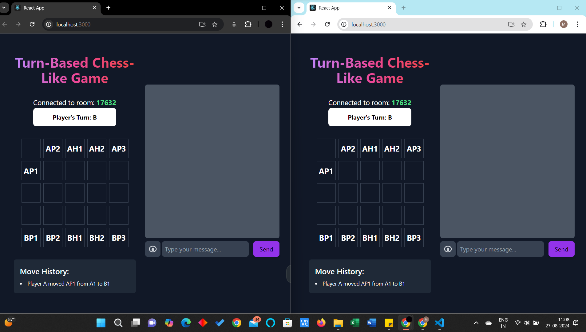
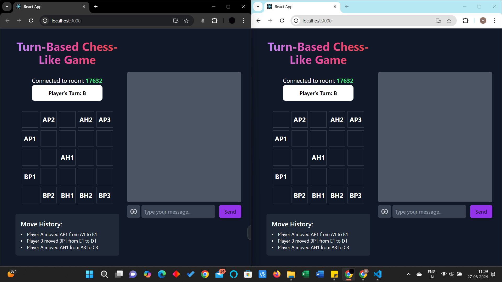
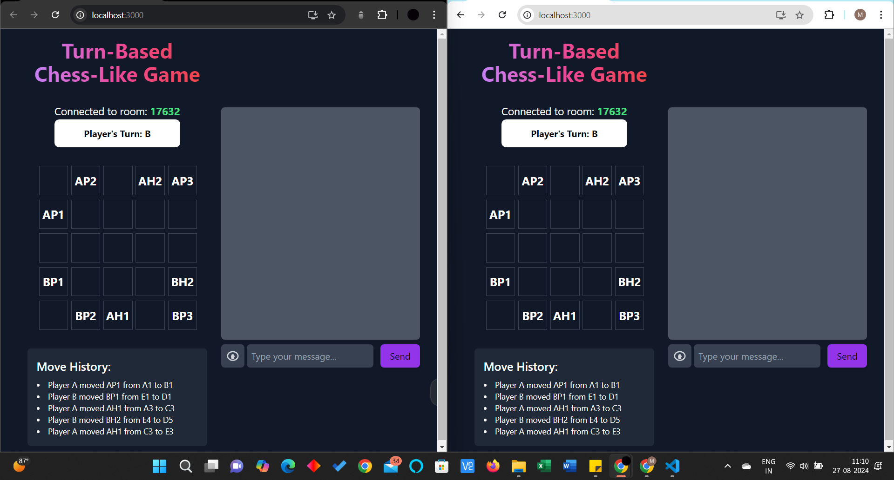
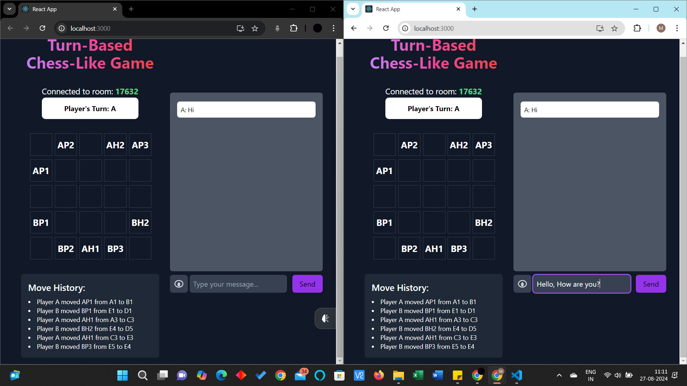

# 🎮 Turn-Based Chess-Like Game ( Game Screenshots are available below, Please check the README thoroughly)

Welcome to the **Turn-Based Chess-Like Game**! 🏆 This project is a strategic, turn-based game played on a 5x5 grid where players control characters with unique movements. Here’s everything you need to know about the game and how to get started.

## 🚀 Features

- **Multiplayer Support**: Play with friends in real-time using WebSocket connections.
- **Turn-Based Gameplay**: Alternate turns with your opponent, making strategic moves.
- **Character Variety**: Control Pawns and Heroes, each with unique movement patterns.
- **Chat Functionality**: Communicate with your opponent during the game.
- **Game Rules Display**: Toggle view to see the game rules and guidelines.

## 🎯 Objective

The goal of the game is to outmaneuver your opponent and control the board. Capture all opponent's characters or force them into a position where they can't make a valid move to win the game.

## 🕹️ Characters

- **Pawns (P1, P2, P3)**: Move one step horizontally or vertically.
- **Hero1 (H1)**: Moves two steps horizontally or vertically.
- **Hero2 (H2)**: Moves diagonally one step.

## 🔧 Setup

At the start:
- **Player A**: Places characters on the top row.
- **Player B**: Places characters on the bottom row.

## 🔄 Turn Order

- Players alternate turns.
- **Player A** starts first.
- Move one character per turn. The game switches to the other player's turn after each move.

## ✔️ Valid Moves

- **Pawns**: Move one step horizontally or vertically.
- **Hero1**: Move two steps horizontally or vertically.
- **Hero2**: Move one step diagonally.

## 🏆 Winning the Game

Capture all of the opponent's characters or force them into a position where they can’t make a valid move.

## 💬 Chat Functionality

Use the chat feature to communicate with your opponent. Messages are broadcasted to all players in the room.

## ⚙️ Additional Rules

- Players must make a move on each turn; failing to do so results in a missed turn.
- Cheating or exploiting bugs can lead to disqualification.

## 📦 Installation

To set up the game locally:

1. **Clone the repository**:

    ```bash
    git clone https://github.com/Mohith705/21BCE7511_BayyaMohith.git
    ```

2. **Navigate to the project directory**:

    ```bash
    cd 21BCE7511_BayyaMohith
    ```

3. **Install dependencies**:

     ```bash
    cd frontend
    npm install
    ```
     
    ```bash
    cd backend
    npm install
    ```

4. **Start the server**:
    ```bash
    cd backend
    npm run start
    ```
5. **Start the game frontend**:
   ```bash
   cd frontend
   npm run start
   ```

## 🖼️ Screenshots

### 1. Game Lobby - The initial lobby of the game looks like:


*The game lobby where players can join or create a room.*

### 2. After the creation of room, on the left side we have player A and player B on the right side.



*The initial setup of the game board with characters placed.*

### 3. The Player A and Player B has moved one Pawn


*Displays which player's turn it is and the current game state.*

### 4. Movement of Head1 in Player A



*The move history showing all the actions taken during the game.*

### 5. Movement of Head2 in Player B


*The chat interface for communicating with the opponent.*

### 6. Warnings on moving Player B Pawn3 to Player B Head2 (Same player B characters)


*The section showing game rules, which can be toggled on or off.*

### 7. Killing Player B Head1 with Player A Head1.



*The winning screen displayed when a player wins the game.*

### 8. We can chat with other player, sending messages from Player B to Player A



*The settings menu for configuring game preferences.*

### 9. Chat Functionality


*The screen where players select their characters before starting the game.*

### 10. We can also add Emoji's in the chat we send.


*Summary of the game showing gameplay and details.*

## 📜 License

This project is licensed under the MIT License - see the [LICENSE](LICENSE) file for details.

## 📫 Contact

For any inquiries or feedback, please reach out to me at [bayyamohith32@gmail.com](mailto:bayyamohith32@gmail.com).

---

Enjoy the game and may the best strategist win! 🎉
